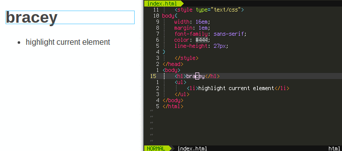
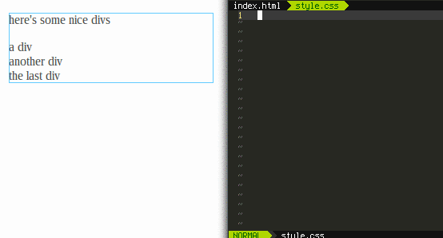
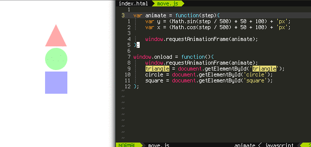
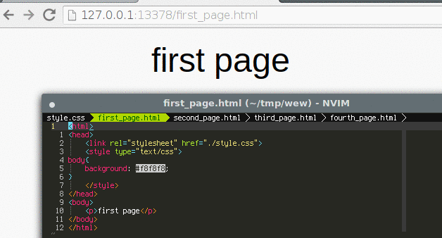

#   
[](https://travis-ci.org/turbio/bracey.vim)

plugin for live html, css, and javascript editing in vim



### live css editing
bracey highlights all the elements selected by the css rule under the cursor.
Any changes to a css file will automatically reload the css file in the browser if it contains no errors



### evaluate javascript on save
by default when a buffer containing javascript is saved, it will be evaluated by the browser



### change page on buffer switch
bracey will always keep the last buffer with html as the current browser page



# installation
(bracey has only been tested on linux)

Bracey follows the standard vim plugin folder structure so it should work with
your plugin manager of choice
* [pathogen](https://github.com/tpope/vim-pathogen)
  * run `git clone https://github.com/turbio/bracey.vim ~/.vim/bundle/bracey.vim`
* [neoBundle](https://github.com/Shougo/neobundle.vim)
  * add `NeoBundle 'turbio/bracey.vim'` to your `.vimrc`
* [vundle](https://github.com/VundleVim/Vundle.vim)
  * add `Plugin 'turbio/bracey.vim'` to your `.vimrc`
* [plug](https://github.com/junegunn/vim-plug)
  * add `Plug 'turbio/bracey.vim'` to your `.vimrc`

bracey requires [nodejs](http://nodejs.org/) to be installed,
along with [npm](https://npmjs.com) for the initial installation of dependencies.
Although, in most cases, npm will probably be installed along with nodejs.

bracey does not include it's javascript dependencies in the repository and they
must be downloaded separately. after the plugin has been installed, you need to
install its dependencies.

1. change into the plugins installation directory. This is different for every
   plugin manager but should be something like
   * `cd ~/.vim/bundle/bracey.vim` for pathogen/neoBundle/vundle
   * `cd ~/.vim/plugged/bracey.vim` for plug
2. run `npm install --prefix bracey`

in order to automatically open your default browser when bracey starts, the
`xdg-open` command must be available.

# usage
bracey won't do anything until it is explicitly called

```
:Bracey
```
this starts the bracey server and optionally opens your default web browser to
bracey's address. if you have an html file open as your current buffer, it will
be displayed and you may begin editing it live.

```
:BraceyStop
```
will shutdown the server and stop sending commands

```
:BraceyReload
```
force the current web page to be reloaded

```
:BraceyEval [args]
```
if argument(s) are given then evaluate them as javascript in the browser.
Otherwise, evaluate the entire buffer (regardless of its filetype).

# configuration
```
g:bracey_browser_command
```
**default:** 0
* (string) command used to launch browser
* 0 if it should be detected automatically using `xdg-open`

```
g:bracey_auto_start_browser
```
**default:** 1
* (false: 0, true: 1) whether or not to start the browser (by running g:bracey_browser_command) when bracey is started

```
g:bracey_refresh_on_save
```
**default:** 0
* (false: 0, true: 1) whether or not to reload the current web page whenever its corresponding buffer is written

```
g:bracey_eval_on_save
```
**default:** 1
* (false: 0, true: 1) whether or not to evaluate a buffer containing javascript when it is saved

```
g:bracey_auto_start_server
```
**default:** 1
* (false: 0, true: 1) whether or not to start the node server when `:Bracey` is run

```
g:bracey_server_allow_remote_connetions
```
**default:** 0
* (false: 0, true: 1) whether or not to allow other machines on the network to connect to the node server's webpage. This is useful if you want to view what changes will look like on other platforms at the same time

```
g:bracey_server_port
```
**default:** random-ish number derived from vim's pid
* (int) the port that the node server will serve files at and receive commands at

```
g:bracey_server_path
```
**default:** 'http://127.0.0.1'
* (string) address at which the node server will reside at (should start with 'http://' and not include port)

```
g:bracey_server_log
```
**default:** '/tmp/bracey_server_logfile'
* (string) location to log the node servers output

# how it works
magic... and javascript
